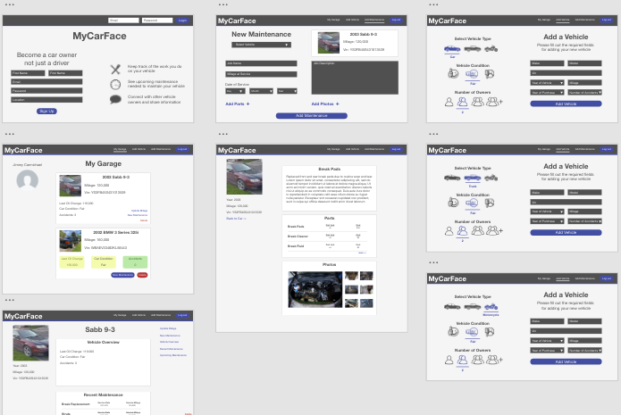

<h1>MyAutoSpace!</h1>

<h1>Description</h1>

MyAutoSpace is must have for any home mechanic.The simple interface allows users to document their vehicle histories and keep up with suggested maintenance. 
<h1>Table of Contents</h1>

<ul>
<li><a href="#installation">Installation</a></li>
<li><a href="#usage">Usage</a></li>
<li><a href="#contributing">Contributing</a></li>
<li><a href="#faq">FAQ</a></li>
<li><a href="#support">Support</a></li>
<li><a href="#license">License</a></li>
</ul>

<h1>Installation</h1>
<h2>Clone or Download</h2>
<ul>
<li>Clone this repo to your local machine or download zip file</li>
</ul>
<h2>Setup</h2>
<ul>

<li>Create a MySQL database called carFacts & create 3 tables: Users, Vehicles, Maintenances ... (Follow the models in the models directory of this project)</li>
<li>Fill out connection information for your MySQL database located in the config.json file & nodemon.json</li>
<li>You must create your own Google Firebase project with a storage bucket and database.</li>
<li>Inside of the .env_sample follow the instructions to insert your credentials and rename the file to .env</li>
<li>Inside of the base_sample.js follow the instructions to insert your credentials and rename the file to base.js</li>
<li>Update and install packages</li>
<li>For this project use this command:<code> npm i </code></li>
</ul>

<h1>Usage</h1>

<h1>Contributing</h1>

<strong>Instructions</strong>

<ul>
<li>

Fork or Clone repo to your local machine

</li>
<li>

HACK AWAY!

</li>
<li>

Create a new pull request

</li>
</ul>

<h1>FAQ</h1>

<ul>
<li><strong>How do I add create an account?</strong>
<ul>
<li>Complete the Sign Up Form. Wait for your image Upload to complete then click signup </li>
</ul>
</ul>

<ul>
<li><strong>How do I add my vehicle?</strong>
<ul>
<li>Log in and click Add Vehicle. </li>
</ul>
</ul>

<h1>Support</h1>

Reach out to us! 
<ul>
<li>GitHub Email: ben.knight.brazil@hotmail.com</li>
<li>GitHub Email:t3rrygong@gmail.com</li>
<li>GitHub Email: georgegombert@gmail.com</li>
<li>GitHub Email: jordaninjohnson@gmail.com</li>
</ul>

<h1>License</h1>

<ul>
<li>License:<code>MIT</code></li>
</ul>

